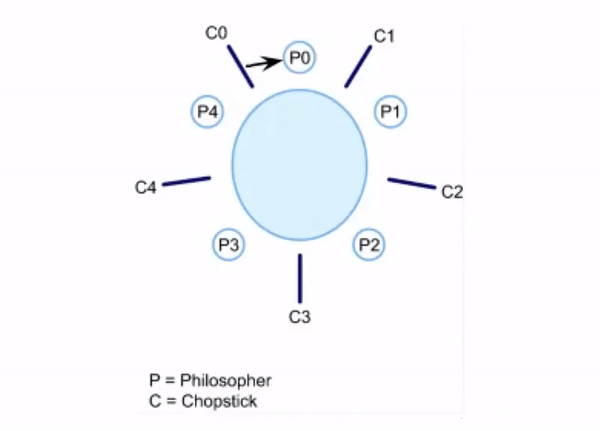

# Jantar Dos Filósofos
***Estudo de Caso — Uni Dom Bosco***
Algoritmo do Jantar dos Filósofos desenvolvido em **Python**

O jantar dos filósofos é um problema sobre a sincronização na  comunicação entre processos e threads em sistemas operacionais. O  problema foi proposto por Edsger W. Dijkstra em 1965 e é considerado um  dos problemas clássicos sobre sistemas operacionais.            

O problema consiste em cinco filósofos sentados ao  redor de uma mesa circular para o jantar, onde cada filósofo possui um  prato para comer macarrão. Os filósofos possuem garfo e cada um precisa de 2 garfos para comer, porém para cada par de pratos existe apenas um  garfo . Um filósofo possui duas ações: pensar ou comer. Quando um  filósofo ficar com fome ele irá tentar pegar o garfo à sua direita e à  sua esquerda, um de cada vez. Se ele conseguir pegar os dois garfos, ele irá comer a comida em um tempo determinado e irá colocar os garfos sobre a mesa novamente, voltando a pensar.            

O objetivo é a criação de um algoritmo que seja  implementado de modo que cada filósofo execute suas ações sem ficar  travado. Caso todos os filósofos peguem um garfo ao mesmo tempo, todos  irão ficar parados para sempre aguardando o segundo garfo ficar  disponível, gerando um Deadlock.             

**Deadlock**, que pode ser traduzido como  "impasse", é uma situação onde dois ou mais processos ficam impedidos de continuar suas execuções. Essa situação ocorre quando um processo  necessita de um recurso do sistema para continuar sua execução e este  está sendo usado por outro processo, que por sua vez também espera pela  liberação de algum recurso utilizado por outro processo. Assim, todos  estes processos ficam bloqueados, esperando uns pelos outros.             

​                **Representação do deadlock no problema**                

Se um filósofo conseguir pegar apenas o primeiro garfo e por isso  devolve-lo a mesa, esperando um tempo fixo para tentar pegar os dois  garfos novamente, teremos um caso de starvation (inanição), onde o  filósofo poderá morrer de fome. Ele poderá tentar fazer a mesma ação de  pegar e depois devolver o garfo pra sempre, nunca conseguindo comer.            A solução do problema é feita para não ocorrer casos de  deadlock ou starvation. Para tal são utilizados os conceitos de semáforo e exclusão mútua (mutex)             

**Mutex**,  acrônimo  para  mutual  exclusion   (exclusão  mútua)  é  uma  técnica utilizada  em  programação   concorrente  para  evitar  que  dois  processos  tenham acesso a  algum  recurso  compartilhado  ao  mesmo  tempo,  sendo  esse  acesso  denominado por região crítica. A forma mais simples de mutex é a  utilização de um semáforo  binário,  bloqueando  o  acesso  ao  recurso  enquanto  uma  tarefa  estiver utilizando-o e liberando em seguida.  Neste caso, os mutexes serão utilizados para controlar o acesso dos  filósofos aos garfos.             
